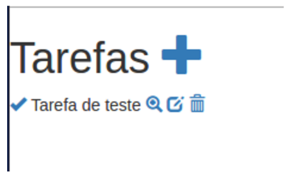

# Vamos mudar a nossa página principal agora...

Mas primeiro, abra o arquivo **app/assets/stylesheets/application.css**, vamos adicionar uma margem ao site, inclua o código abaixo no arquivo:

```css
body {
  margin: 10px;
}
```

Agora, vamos mudar o estilo da nossa mensagem, substitua a linha:

```html
<p id="notice"><%= notice %></p>
```

Por essa:

```html
<% if notice %>
  <div class="alert alert-success alert-dismissible" role="alert">
    <button type="button" class="close" data-dismiss="alert" aria-label="Close"><span aria-hidden="true">&times;</span></button>
    <%= notice %>
  </div>
<% end %>
```

Esse é um código pego do [Boostrap](http://getbootstrap.com]) mesmo, você pode encontrar na sessão [Components](http://getbootstrap.com/components/).

Agora, substitua todo o código da index, pelo código abaixo:

```html
<% if notice %>
  <div class="alert alert-success alert-dismissible" role="alert">
    <button type="button" class="close" data-dismiss="alert" aria-label="Close"><span aria-hidden="true">&times;</span></button>
    <%= notice %>
  </div>
<% end %>
<div id="tarefas">
  <h1>
    Tarefas
    <%= link_to(new_tarefa_path, title: 'Adicionar tarefa') do %>
      <span class="glyphicon glyphicon-plus" aria-hidden="true"></span>
    <% end %>
  </h1>
  <% @tarefas.each do |tarefa| %>
    <div class="tarefa">
      <% if tarefa.completo %>
        <%= link_to(completar_tarefa_path(tarefa), title: 'Desfazer tarefa', class: 'desfazer-tarefa') do %>
          <span class="glyphicon glyphicon-remove" aria-hidden="true"></span>
        <% end %>
      <% else %>
        <%= link_to(completar_tarefa_path(tarefa), title: 'Finalizar tarefa', class: 'finalizar-tarefa') do %>
          <span class="glyphicon glyphicon-ok" aria-hidden="true"></span>
        <% end %>
      <% end %>
      <span><%= tarefa.nome %></span>
      <%= link_to(tarefa, title: "Mostrar tarefa") do %>
        <span class="glyphicon glyphicon-zoom-in" aria-hidden="true"></span>
      <% end %>
      <%= link_to(edit_tarefa_path(tarefa), title: 'Editar tarefa') do %>
        <span class="glyphicon glyphicon-edit" aria-hidden="true"></span>
      <% end %>
      <%= link_to(tarefa, method: :delete, data: { confirm: 'Are you sure?' }, title: 'Excluir tarefa') do %>
        <span class="glyphicon glyphicon-trash" aria-hidden="true"></span>
      <% end %>
    </div>
  <% end %>
</div>
```

O que fizemos no passo anterior, foi basicamente remover o tabela que tinha, e mostrar a informação de uma maneira diferente, utilizando **div**.

Nós também alteramos a maneira como os links são mostrados, para usar os ícones do bootstrap. Mas continua sendo como quando criamos o link da primeira vez.

Se você iniciar a aplicação, com o comando **rails server**, lembra? E ir no navegador, deverá estar vendo algo como:



Note que as informações continuam as mesmas, nós praticamente só mudamos os links para ícones :)

Caso queira saber mais sobre _html_ e sobre como _alteramos os links com ruby_, você pode acessar esses links:
- [http://www.w3schools.com/html/](http://www.w3schools.com/html/)

- [http://api.rubyonrails.org/classes/ActionView/Helpers/UrlHelper.html#method-i-link_to](http://api.rubyonrails.org/classes/ActionView/Helpers/UrlHelper.html#method-i-link_to) _(está em inglês, mas você sempre pode usar o google tradutor :))_
