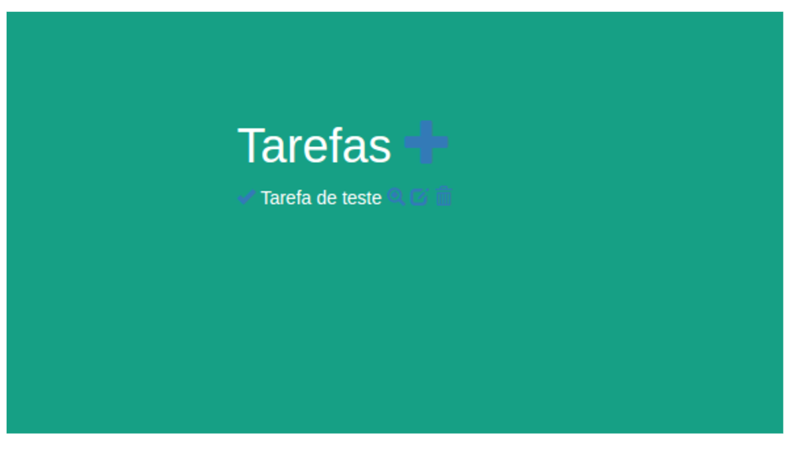
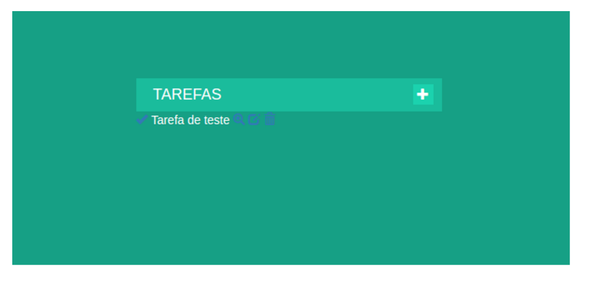
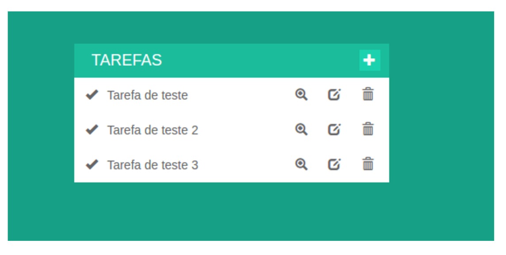

# Mexendo com CSS

Vamos adicionar um estilo a nossa tela?

```css
body {
 background: #16a085;
 color: #fff;
}

#tarefas {
  position: absolute;
  width: 360px;
  top: 55%;
  left: 50%;
  margin: -122px 0 100px -180px;
}
```

Esse código adiciona uma cor no fundo da tela, e diz que por padrão a cor do texto será branca, e em **#tarefas**, diz que essa div, ficará no centro da tela.

Você deve estar vendo algo como a imagem abaixo:



Já está mudando, né? Abaixo do código que adicionou antes, escreva esse:

```css
#tarefas h1 {
  position: relative;
  background-color: #1abc9c;
  color: #fff;
  margin: 0;
  padding: 10px 20px;
  font-size: 18px;
  text-transform: uppercase;
  font-weight: 400;
}
#tarefas h1 a {
  position: absolute;
  top: 50%;
  right: 10px;
  background-color: #1BD2AE;
  width: 24px;
  height: 24px;
  margin: -12px 0 0 0;
  color: #fff;
  font-size: 14px;
  line-height: 24px;
  text-align: center;
  text-decoration: none;
}
```

Agora você deve estar vendo algo como essa imagem:



O código que adicionamos, posicionou a tag **h1** (TAREFAS) certinho, e também colocou uma cor de fundo.

Também estilizamos o botão de adicionar uma nova tarefa, adicionando um fundo, cor de fonte e posicionamento.

Estamos quase no fim :) Adiciona mais esse código agora, vamos dar estilo as tarefas:

```css
.tarefa {
    background-color: #fff;
    height: 40px;
    color: #666;
    line-height: 40px;
}

.tarefa span {
  width: 55%;
  display: inline-block;
}

.tarefa a {
  display: inline-block;
  color: #666;
  text-align: center;
  text-decoration: none;
  padding: 0 10px;
}
```

Nesse código, estamos colocando um plano de fundo para cada tarefa, alterando a cor da fonte e dos ícones também.

Agora já temos nossas tarefas listadas :D Você deve estar vendo algo assim:


