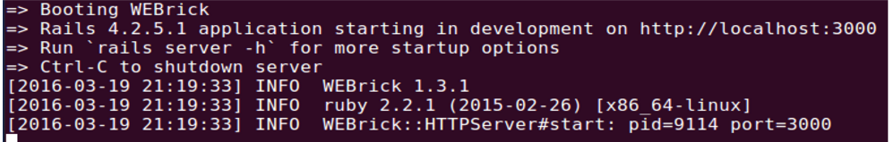
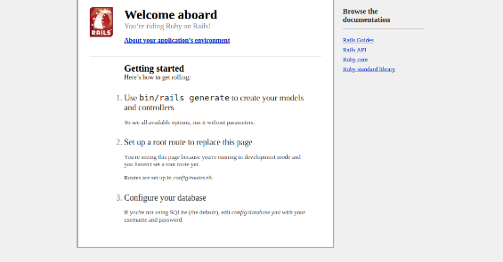

# Iniciando a aplicação

No terminal, escreva o comando abaixo e tecle ENTER:

```sh
rails new to-do-list
```

Esse comando vai criar uma pasta chamada “to-do-list” dentro do diretório que você já estiver (importante prestar atenção nisso). Que será o nome do nosso projeto também, nele teremos uma aplicação Ruby on Rails padrão já configurada com o nome do nosso projeto.

Vamos entrar na pasta que o Rails criou com o projeto, ainda no terminal, digite:

```sh
cd to-do-list
```

Sempre que criamos um projeto com o Rails, ele vai criar uma pasta com o nome que demos a esse projeto. Nela estarão todos os arquivos necessários.

## Verificando se tudo está funcionando

No terminal, escreva o comando abaixo e tecle ENTER:

```sh
rails server
```

Você verá algo parecido com isso no terminal:



Esse comando inicia a aplicação rails. Fazendo com que possamos acessar nossa aplicação pelo navegador.

Agora podemos abrir o navegador e digitar:

```
localhost:3000
```

Você verá uma tela como a imagem abaixo, isso quer dizer que tudo está funcionando direitinho :D



Para parar o servidor, é só ir no terminal e teclar CRTL+C