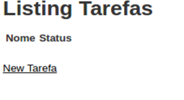

# Procurando as tarefas

Agora vamos aprender algo novo do Rails, que são as **rotas**, que nada mais são do que caminhos que o Rails cria ao criarmos algo novo. Isso tudo naquele primeiro comando que executamos para criar a Tarefa (rails scaffold...), lembra?

As rotas, ficam num arquivos chamado **routes.rb**, você pode encontrar ele na pasta **config**, dentro da pasta do projeto. Vamos abrir esse arquivo, nele, deve haver uma linha com o conteúdo abaixo:

```
resources :tarefas
```

Ok, mas o que isso significa? O Rails já cria muitas coisas pra gente, e nessa linha, ele cria automático, todos os caminhos pra criarmos, atualizarmos, vermos, e excluirmos uma tarefa.

Você pode aprender mais sobre rotas nos seguintes links:
[https://www.caelum.com.br/apostila-ruby-on-rails/rotas/#8-7-exercicio-rotas](https://www.caelum.com.br/apostila-ruby-on-rails/rotas/#8-7-exercicio-rotas)
[http://www.devmedia.com.br/introducao-a-rotas-e-responders-no-ruby-on-rails/33521](http://www.devmedia.com.br/introducao-a-rotas-e-responders-no-ruby-on-rails/33521)


Agora, se digitarmos no navegador:

```
localhost:3000/tarefas
```

Vamos ver a imagem abaixo. Uhuul!! Podemos criar nossas tarefas agora :D



Mas calma, e se eu quiser que quando acessar o site, ele caia direto na tela das tarefas ao invés daquela tela do Rails?

Podemos fazer isso também, vamos lá!

### Dizendo pro rails que a primeira tela é a de tarefas

Vamos abrir o arquivo **routes.rb** de novo. Lembra onde ele está? Em **config/routes.rb**.
Vamos mudar algo nele, agora, as duas primeiras linhas devem estar assim:

```ruby
Rails.application.routes.draw do
  resources :tarefas
```

Altere ele para que fique assim:

```ruby
Rails.application.routes.draw do
  root ‘tarefas#index’
  resources :tarefas
```

Nós adicionamos a linha root **‘tarefas#index’**, que diz ao Rails que ao acessarmos **“localhost:3000”** ele deve enviar para a tela das tarefas na ação index (logo falaremos sobre ações :))

### E quando acessamos no navegador agora...

No terminal digite o comando abaixo para iniciar a aplicação, caso esteja rodando já, lembre de parar, teclando CTRL+C e iniciando de novo:

```sh
rails server
```

E no navegador:

```
localhost:3000
```


Lindo!! Agora o Rails entende que a primeira tela deve ser a de tarefas :D
