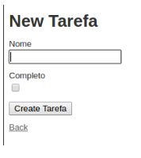
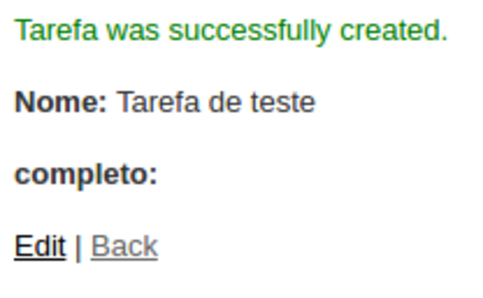
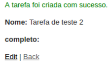

# Vamos criar algumas tarefas, pra ver o que acontece

Agora podemos ver a tela das nossas tarefas, mas ainda não cadastramos nenhuma, vamos fazer isso?
Se no terminal não estiver executantodo o comando abaixo, lembre-se de fazer :)

```sh
rails server
```

E no navegador

```
localhost:3000
```

Agora podemos clicar em **New tarefa** e vamos ir para outra tela, como a imagem abaixo.
Podemos preencher o campo **Nome** e clicar no botão **Create Tarefa**



Após clicar no botão **Create Tarefa**, vamos ir para uma página como a imagem abaixo.



A tela vai ter os dados da tarefa que acabamos de criar, e uma mensagem de que foi criado com sucesso.

**Mas a mensagem está em inglês, assim como um monte de outras coisas.**

Vamos mudar isso?

### vamos começar pelas mensagens

Vamos começar a mexer no código agora :D

Vamos abrir o arquivo **tarefas_controlles.rb**, que é o arquivo que controla todas as ações sobre as tarefas (lembra que comentamos sobre isso ao criar a rota?). Ele está em **app/controllers/tarefas_controller.rb**

Esse arquivo tem vários _métodos_ (lembra como são métodos no ruby?), que estão separados nas ações de criar (_create_), atualizar (_update_), excluir (_destroy_), _index_ (lembra a ação que colocamos no routes.rb?) - esta será a ação que lista todas nossas tarefas, _show_ (mostrar a tarefa).

Todas essas _ações_, são métodos padrões que o Rails cria automático para nós, quando executamos aquele primeiro comando para criar a Tarefa.

Agora, vamos procurar no arquivo onde estão as mensagens que aparecem, quando criamos ou atualizamos uma tarefa.
Por exemplo, você pode procurar o método **create**, deve ser algo como o código abaixo:

```ruby
def create
    @tarefa = Tarefa.new(tarefa_params)

    respond_to do |format|
      if @tarefa.save
        format.html { redirect_to @tarefa, notice: 'Tarefa was successfully created.' }
        format.json { render :show, status: :created, location: @tarefa }
      else
        format.html { render :new }
        format.json { render json: @tarefa.errors, status: :unprocessable_entity }
      end
    end
  end
```

Esse é o método chamado quando clicamos no botão **Create tarefa**.
Ele cria uma tarefa nova, com os dados que colocamos no campo e retorna o html que mostra a tarefa, informando a mensagem. Vamos mudar a mensagem você pode procurar o método **create**, na linha onde está escrito

```ruby
format.html { redirect_to @tarefa, notice: 'Tarefa was successfully created.' }
```

Vamos alterar para

```ruby
format.html { redirect_to @tarefa, notice: 'A tarefa foi criada com sucesso.' }
```

O método todo deve ficar mais ou menos assim:

```ruby
def create
    @tarefa = Tarefa.new(tarefa_params)

    respond_to do |format|
      if @tarefa.save
        format.html { redirect_to @tarefa, notice: 'Tarefa was successfully created.' }
        format.json { render :show, status: :created, location: @tarefa }
      else
        format.html { render :new }
        format.json { render json: @tarefa.errors, status: :unprocessable_entity }
      end
    end
  end
```

Agora é a sua vez, pode fazer o mesmo no método **update** e **destroy** :D

### Vamos testar a mensagem nova?

No terminal digite o comando abaixo para iniciar a aplicação, caso esteja rodando já, lembre de parar, teclando CTRL+C e iniciando de novo:

```sh
rails server
```

E no navegador:

```
localhosr:3000
```

Vamos criar uma tarefa nova, e ver o que acontece. Yeyy, nossa mensagem
está em português!



### Continuando...

Ok, agora nós já temos uma aplicação que nos permite criar, atualizar e excluir nossas tarefas. Mas ainda falta algo. Nós ainda não podemos dizer que uma tarefa esta completa, vamos fazer isso?
